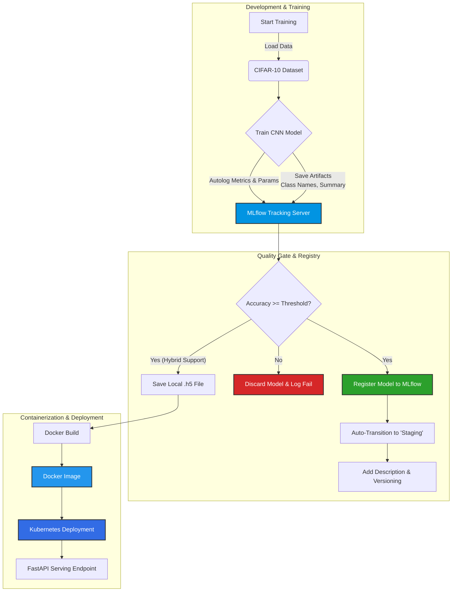

#  End-to-End MLOps Pipeline: CIFAR-10 Classification

Bu proje, Derin Öğrenme modellerinin (CNN) geliştirilmesinden üretim ortamına (Production) dağıtımına kadar olan **MLOps yaşam döngüsünü** simüle eder. Model eğitimi, gelişmiş deney takibi, koşullu model kaydı, versiyonlama, konteynerizasyon ve Kubernetes orkestrasyon süreçlerini kapsar.

##  MLOps Mimarisi ve İş Akışı

Projenin veri akışı, eğitim mantığı ve dağıtım stratejisi aşağıdaki diyagramda özetlenmiştir:



##  Proje Yapısı

```bash
├── .github/workflows/          # CI/CD Pipeline tanımları (GitHub Actions)
├── deployment.yaml
│── service.yaml
├── main.py                     # FastAPI Model Serving Uygulaması
├── train_mlflow_advanced.py    # Koşullu mantık içeren Gelişmiş Eğitim Scripti
├── requirements.txt            # Python bağımlılık listesi
├── Dockerfile                  # API için optimize edilmiş Docker imaj tanımı
└── README.md                   # Proje dokümantasyonu
```

##  Kurulum ve Çalıştırma

### 1\. Ön Hazırlık (Lokal Geliştirme)

Repoyu klonlayın ve sanal ortam oluşturarak bağımlılıkları yükleyin:

```bash
git clone https://github.com/keremkartal/cifar-mlops-proje.git
cd cifar-mlops-proje

python3 -m venv venv
source venv/bin/activate
pip install -r requirements.txt
```

### 2\. MLflow ile Model Eğitimi (Tracking & Registry)

Bu aşamada iki terminal kullanılması önerilir.

**Terminal 1: MLflow Sunucusunu Başlat**

```bash
mlflow server \
    --backend-store-uri sqlite:///mlflow.db \
    --default-artifact-root ./mlruns \
    --host 0.0.0.0 \
    --port 5000
```

**Terminal 2: Eğitimi Başlat**
Script, model başarımı belirlenen eşiği (varsayılan %60) geçerse modeli otomatik olarak **Staging** aşamasına taşır ve Docker uyumluluğu için lokal bir kopya oluşturur.

```bash
python train_mlflow_advanced.py
```

*Eğitim sonuçlarını `http://localhost:5000` adresinden takip edebilirsiniz.*

### 3\. Docker ile Paketleme ve Çalıştırma

Başarılı eğitim sonrası oluşan model ile API'yi konteynerize edin:

```bash
# İmajı oluştur
docker build -t cifar-api:latest .

# Konteyneri çalıştır
docker run -d -p 8000:8000 --name mlops-api cifar-api:latest
```

*API Swagger Dokümantasyonu: `http://localhost:8000/docs`*

### 4\. Kubernetes (Minikube) Dağıtımı

Uygulamayı ölçeklenebilir bir cluster üzerinde simüle etmek için:

```bash
# Minikube'ü başlat (Docker driver ile)
minikube start --driver=docker

# Kaynakları uygula
kubectl apply -f deployment.yaml
kubectl apply -f service.yaml

# Servise erişim URL'ini al
minikube service cifar-api-service
```

##  Öne Çıkan Özellikler

  * **Advanced MLflow Tracking:** Epoch, Batch Size, Learning Rate gibi hiperparametrelerin ve Loss/Accuracy metriklerinin detaylı takibi.
  * **Model Signature & Input Schema:** Modelin beklediği veri tipinin (Tensor spec) MLflow'a gömülmesi (Input Validation için).
  * **Quality Gate (Kalite Kapısı):** Sadece belirlenen başarı kriterini (Threshold) geçen modellerin Registry'ye kabul edilmesi.
  * **Automated Lifecycle Management:** Başarılı modellerin otomatik olarak versiyonlanması, açıklama eklenmesi ve **Staging** aşamasına taşınması.
  * **Hybrid Workflow:** Hem modern MLflow Registry yapısını hem de Docker build süreçleri için klasik dosya tabanlı (`.h5`) yapıyı destekleyen esnek mimari.
  * **Artifact Logging:** Sadece modelin kendisini değil; sınıf isimleri (`class_names.txt`) ve model özeti (`model_summary.txt`) gibi meta verilerin de versiyonlanması.
